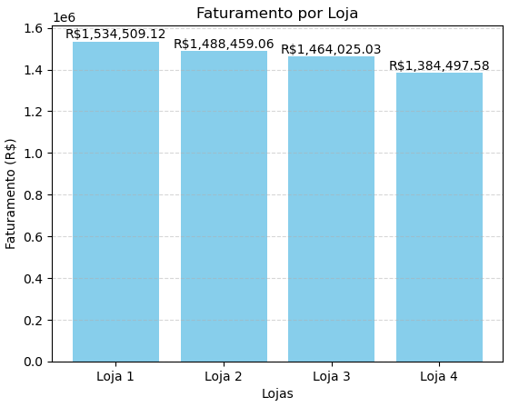
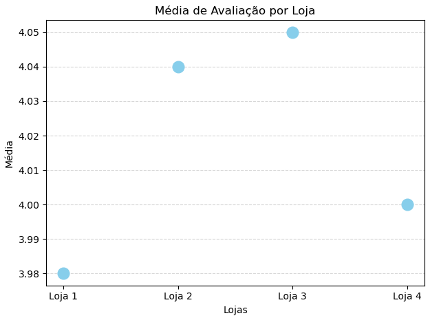
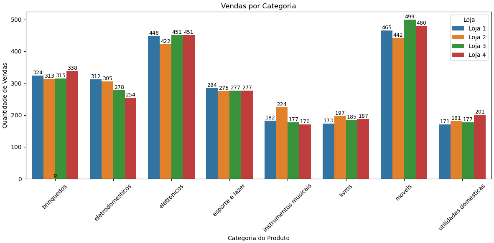

# 🛍️ Alura Store - Análise de Vendas

Este projeto tem como objetivo realizar uma análise exploratória de dados de uma rede fictícia de lojas chamada **Alura Store**, utilizando Python e bibliotecas como `pandas`, `matplotlib` e `seaborn`. O foco é oferecer insights que ajudem o Sr. João, proprietário da rede, a tomar decisões estratégicas — como **qual loja vender ou manter** com base no desempenho.

---

## 🎯 Propósito da Análise

A análise visa responder à pergunta central:

> **"Qual das quatro lojas apresenta menor eficiência para que possa ser vendida?"**

Para isso, foram considerados os seguintes critérios:
- Faturamento total por loja.
- Média de avaliações dos clientes.
- Valor médio do frete.
- Produtos mais e menos vendidos por loja.
- Categorias de produtos mais vendidas.

---

## 🗂️ Estrutura do Projeto

📁 desafio/ ├── 📊 entrega-desafio.ipynb # Notebook principal da análise, gráficos e insights ├── 📊 # Datasets de cada loja ├── loja1.csv │ ├── loja2.csv │ ├── loja3.csv │ └── loja4.csv ├── 📁imagens/ # Pasta de imagem dos gráficos │ ├── faturamento_lojas.png │ ├── vendas_categoria.png │ └── avaliacoes.png | └── README.md # Arquivo de descrição do projeto (este arquivo)

---

## 📊 Exemplos de Gráficos e Insights

### 📌 Faturamento Total por Loja

**Insight:** A Loja 1 possui o maior faturamento, ultrapassando R$1.500.000, enquanto a Loja 4 possui o menor valor.

---

### ⭐ Avaliação Média por Loja

**Insight:** As avaliações dos clientes são similares, mas a Loja 3 se destaca com a melhor média de satisfação (4.05).

---

### 📦 Categoria de Produtos Mais Vendidos

**Insight:** A categoria **"móveis"** lidera em volume de vendas em todas as lojas, sendo uma forte tendência de consumo.

---

## ⚙️ Como Executar o Projeto

Para executar este projeto localmente:

1. Clone este repositório ou baixe o ZIP;
2. Instale as bibliotecas necessárias (caso não tenha):
    pip install pandas matplotlib seaborn
3. Abra o arquivo *entrega-desafio.ipynb* com o Google Colab ou Jupyter Notebook;
4. Execute as células para visualizar os gráficos e insights.
